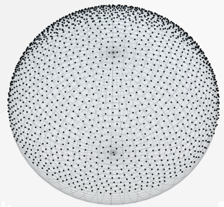
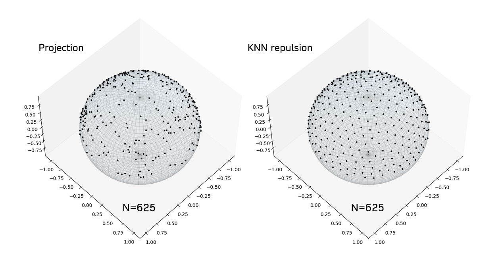
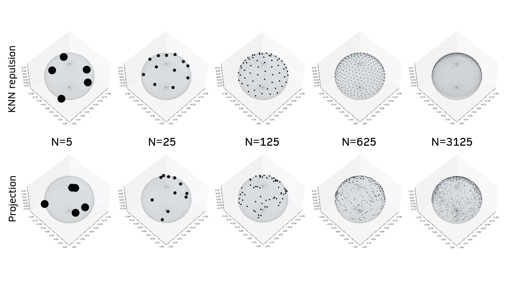
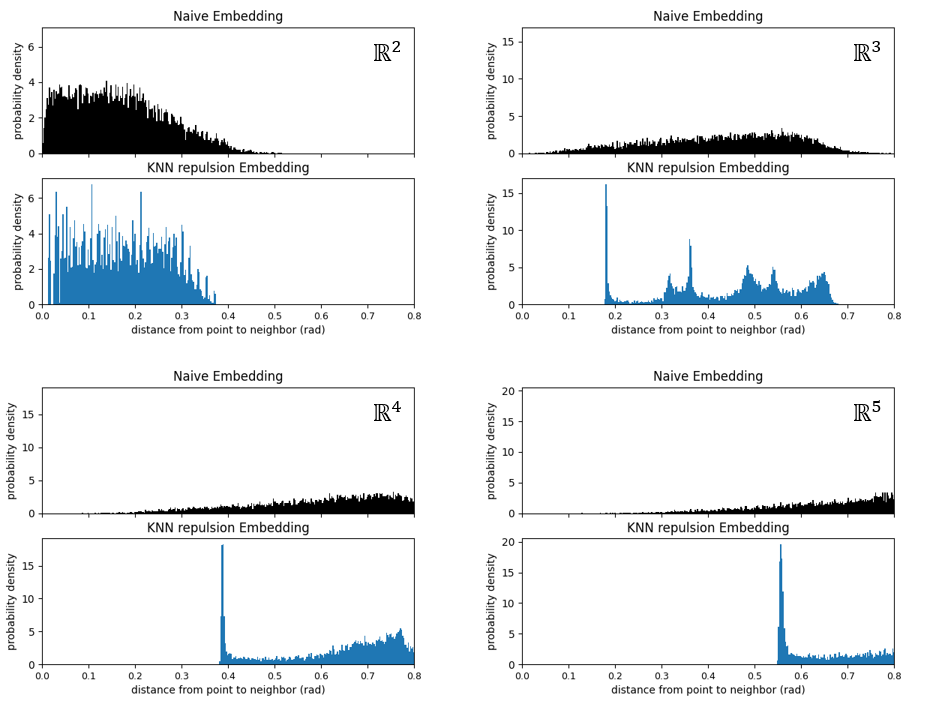

## Overview - UOS

Generating evenly distributed points on the surface of a hypersphere of radius 1. 

The function `UniformOrientationSampling.run_optimizer()` in `Uniform_Orientation_Sampling.py` finds a set of `pop_size` points on the surface of a hypersphere in a space of `dimensions` dimensions. The result is obtained using an particle simulation-based optimization process that encourages all vectors to be equidistant from their nearest neighbors. The final embedding consists in unit vectors that uniformly and efficiently sample orientations in the space. 

This is useful in applications where you are searching for optima in a continuous space. Certain gradient-decent-based algorithms require evaluating a cost function at a local set of points surrounding the current-best location. This current location would then be updated by moving towards the local point with the minimum cost value. In dimensions greater than 2, it is not obvious how to optimally sample a set of local test points. The algorithm developed here offers one solution. 

*Fig. (left) 625 orientation vectors in 3D sampled using a naive approach. These points were obtained by uniformly sampling (x, y, z) coordinates in the range [-0.5, 0.5] and then projecting all points onto the sphere by normalization to length 1. (right) Vectors obtained by the "KNN repulsion" algorithm used in UniformOrientationSampling. Only the top half of points was plotted for clarity.*

One obvious, projection-based, approach (Fig left) leads to an inefficient sampling of directions due to the heterogeneous density of points. For example, there are typically several near-redundant points. The UOS algorithm generalizes well to both large (e.g. ~1E3) and small (e.g. 8) sample sizes, at a range of dimensionalities. I'll discuss how this can be shown next.

## Demonstrating it works in higher dimensions
I developed a signature of the point distribution that suggests the UOS algorithm finds a evenly-spaced set of points in several dimensions higher than 3. The code computing this signature can be found in `Evaluations.py`. See `demo.py` for usage. The signature is found by looking at the distribution of distances from a point to its nearest neighbors. In the 3D case, points typically arrange in to an imperfect hexagonal lattice. This causes there to be a sharp spike in probability at a certain distance, namely, the distance of the first nearest neighbors. I found that this spike was present in dimensions up to 10, but I have not tested beyond that. 

Importantly, the spike is not present when using the projection-based approach shown in the figures above. The black distributions below show the nearest-neighbors distance distribution for embeddings using this approach, and the blue distributions correspond to UOS embeddings. In the sample+project embeddings, two points can end up extremely close, and this leads to low inter-point distance having significant probability.

## Usage
See `demo.py`, `plots.py`, and docstrings in python files.

## Python Dependencies
- numpy
- pandas
- matplotlib
- scikit-learn
- plotly
- tqdm
